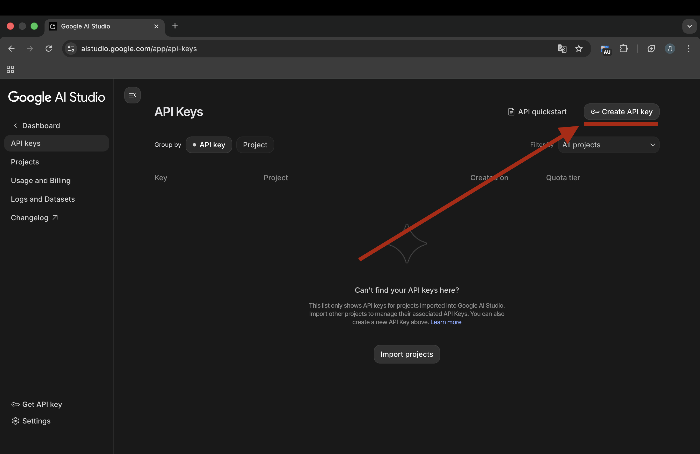
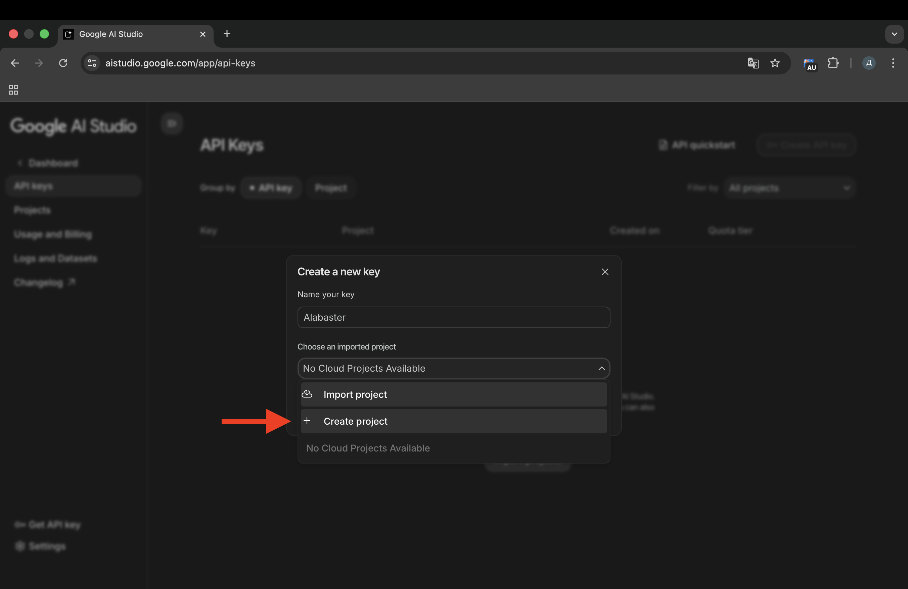
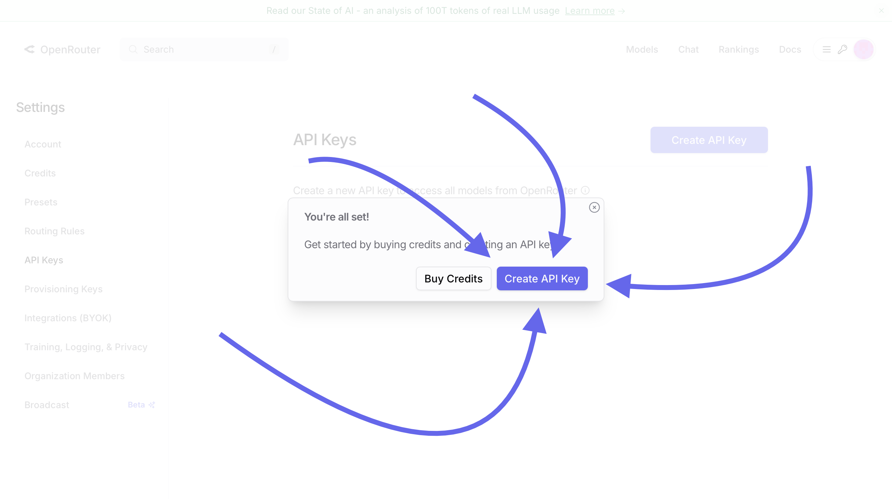
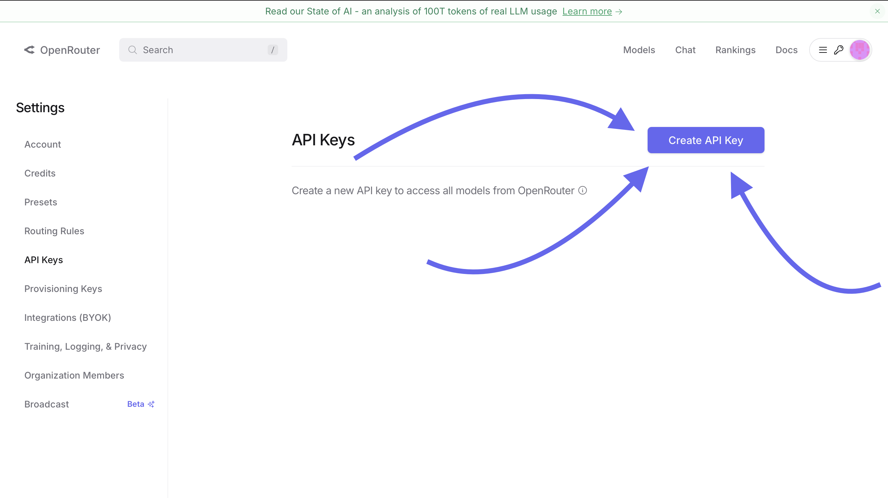
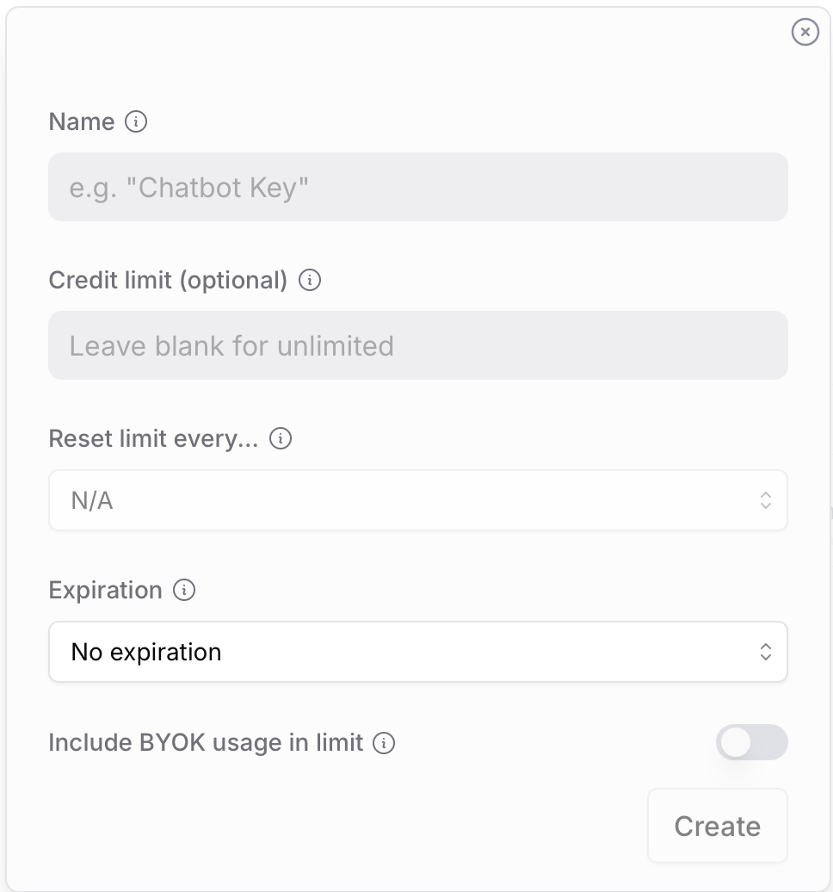
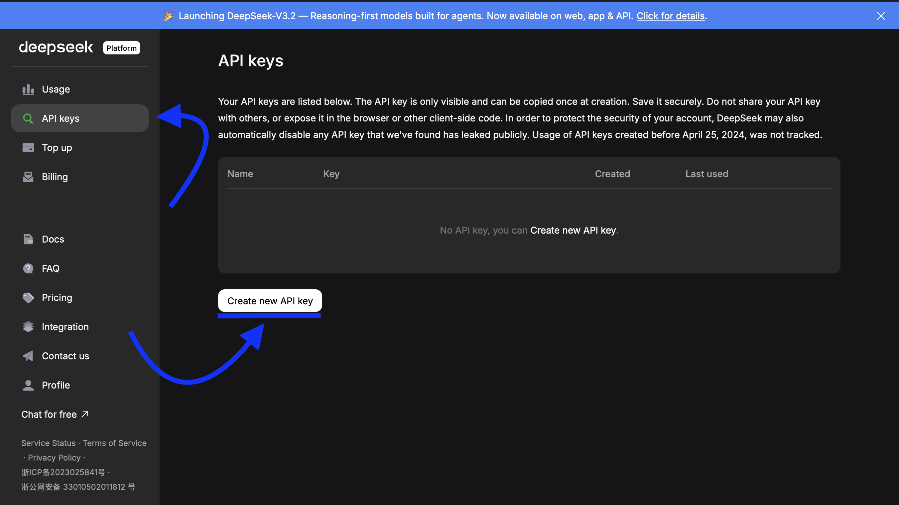

# 🔌 Настройка AI Провайдеров

В этом разделе описано, как получить API ключи для подключения различных моделей к боту.

---

## 💎 Google Gemini

Бесплатный (с ограничениями) и быстрый доступ к моделям Gemini 1.5 Flash и Pro.

1. Перейдите в **[Google AI Studio](https://aistudio.google.com/app/apikey)**.
2. Войдите в свой Google аккаунт.
3. Нажмите кнопку **Create API key**.
   
4. В появившемся окне выберите *Create API key in new project*.
   
5. Скопируйте строку, начинающуюся с `AIza...`.

---

## ⚡ OpenRouter

Агрегатор, дающий доступ к Claude 3.5, GPT-4o, Llama 3 и сотням других моделей через один единый ключ.

1. Зарегистрируйтесь на сайте **[OpenRouter.ai](https://openrouter.ai/keys)**.
   
2. Перейдите в раздел **API Keys** и нажмите **Create API Key**.
   
3. Заполните форму создания:
   
    *   **Name:** Любое имя (например, `MyBot`).
    *   **Credit limit:** Оставьте пустым (для использования общего баланса без лимитов).
    *   **Expiration:** Оставьте *No expiration* (ключ будет работать вечно).
4. Нажмите **Create**.
5. **Сразу скопируйте ключ** `sk-or-v1-...` (он показывается только один раз).

---

## 🤖 OpenAI Compatible

Этот тип подключения используется для DeepSeek, Groq, оригинального OpenAI или локальных моделей (Ollama).

Вам понадобятся два параметра:
1.  **API Key** (получаете на сайте сервиса).
2.  **Base URL** (адрес сервера, см. таблицу ниже).

### Таблица Base URL

Бот запрашивает `EndpointUrl`, скопируйте нужную ссылку:

| Сервис                   | EndpointUrl                      |
| :----------------------- | :------------------------------- |
| **DeepSeek**             | `https://api.deepseek.com`       |
| **Groq**                 | `https://api.groq.com/openai/v1` |
| **OpenAI (Официальный)** | `https://api.openai.com/v1`      |
| **Ollama (Локально)**    | `http://localhost:11434/v1`      |
| **LM Studio (Локально)** | `http://localhost:1234/v1`       |

### Пример получения ключа (DeepSeek)

DeepSeek — одна из самых дешевых и умных моделей (аналог GPT-4).

1. Зайдите на **[DeepSeek Platform](https://platform.deepseek.com/api_keys)**.
2. Войдите через Google или зарегистрируйтесь.
3. В меню слева выберите **API Keys** -> **Create API Key**.
   
4. Введите имя и нажмите **Create**.
5. Скопируйте ключ `sk-...`.

⚠️ **Важно:** При настройке DeepSeek в боте не забудьте вставить ссылку `https://api.deepseek.com` в поле **EndpointUrl**.